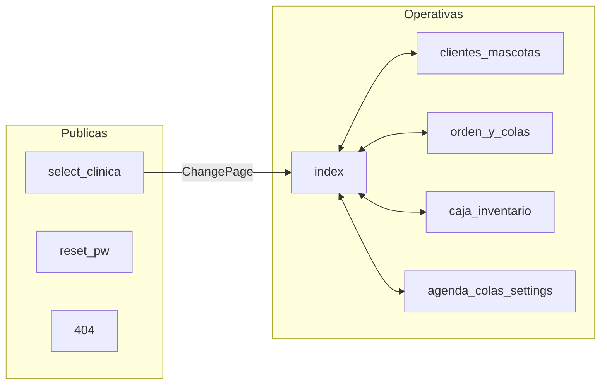
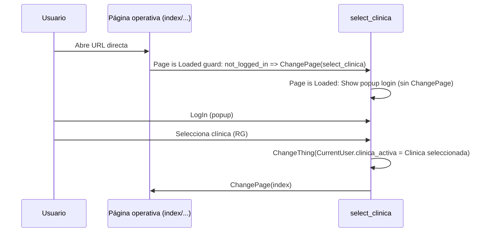
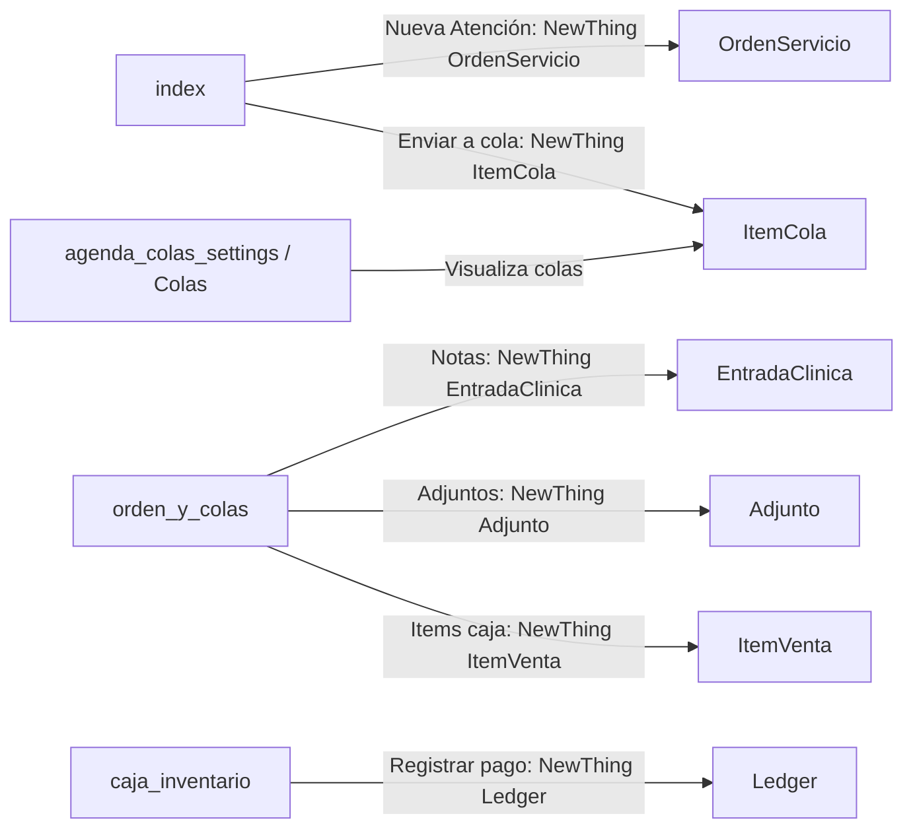

# VetERP — app_flow_map.md (mapa de páginas, estados y flujos)

## Índice
1. Mapa de páginas (site map)
2. Estados de usuario
3. Flujo logged out
4. Flujo logged in sin membresía
5. Flujo logged in con membresía pero sin clínica activa
6. Flujo con clínica activa (módulos operativos)
7. Data Write Map (qué escribe qué)
8. Huecos / NO CONFIRMADO

---

## 1) Mapa de páginas (site map)

Páginas web (8):
- Públicas: `select_clinica`, `reset_pw`, `404`  
- Operativas (guard): `index`, `clientes_mascotas`, `orden_y_colas`, `caja_inventario`, `agenda_colas_settings`

**Evidencia:** auditoría maestra (mapa de páginas) + auditoría de navegación/acceso (guards).

### 1.1 Diagrama (Mermaid)



**NO CONFIRMADO:** el destino exacto de algunos `ChangePage` post-login/logout en todas las páginas (la auditoría confirma “select_clinica → index” para selección de clínica, pero el resto puede variar por página).

---

## 2) Estados de usuario

Definidos por condiciones usadas en guards:
1. **Logged out**: `CurrentUser is not_logged_in`
2. **Logged in sin MembresiaClinica**: `logged_in` y `Search(MembresiaClinica where user=CurrentUser):count = 0`
3. **Logged in con MembresiaClinica pero sin clínica activa**: `logged_in` y `membresia_count > 0` y `CurrentUser.clinica_activa... is empty`
4. **Logged in con MembresiaClinica y clínica activa**: `logged_in` y `membresia_count > 0` y `clinica_activa NOT empty`

**Evidencia:** “SISTEMA DE NAVEGACIÓN, ACCESO Y SESIÓN” (guards).

---

## 3) Flujo logged out

### 3.1 Flujo principal (desde una página operativa)



**Evidencia:** casos A/B de “flujo completo de entrada” + “workflow que guarda clínica activa”.

### 3.2 Variante: llega directo a `select_clinica`
Mismo flujo, pero sin el paso de redirección inicial.

---

## 4) Flujo logged in sin membresía

El guard de páginas operativas redirige a `select_clinica` si el usuario no tiene registros en `MembresiaClinica`.

Resultado reportado:
- el usuario puede quedar **atrapado** en `select_clinica` si no puede ver clínicas (RG vacío) y no hay workflow alternativo.

```mermaid
flowchart TD
  A[Usuario logueado] --> B{Tiene MembresiaClinica?}
  B -- No (count=0) --> C[Redirect a select_clinica]
  C --> D{RG Clinica visible?}
  D -- No --> E[RG vacío + mensaje: \"Sin clínicas disponibles\"]
  D -- Sí --> F[Puede seleccionar clínica]
```

**Evidencia:** “CASO C” del flujo de entrada.

---

## 5) Flujo logged in con membresía pero sin clínica activa

```mermaid
flowchart TD
  A[Usuario logueado] --> B{MembresiaClinica count > 0}
  B -- Sí --> C{clinica_activa vacía?}
  C -- Sí --> D[Redirect a select_clinica]
  D --> E[Selecciona clínica]
  E --> F[ChangeThing(CurrentUser.clinica_activa = Clinica)]
  F --> G[ChangePage index]
```

**Evidencia:** “CASO D” del flujo de entrada.

---

## 6) Flujo con clínica activa (módulos operativos)

### 6.1 Navegación base (navbar)
Con clínica activa, el usuario navega entre:
`index` ↔ `orden_y_colas` ↔ `clientes_mascotas` ↔ `caja_inventario` ↔ `agenda_colas_settings`.

**Evidencia:** flujo general entre páginas + navegación (navbar presente).

### 6.2 “Happy path” de atención (end-to-end)



**Notas:**
- La creación/vínculo de `Venta` con `OrdenServicio`/`ItemVenta` aparece en auditorías posteriores como zona frágil (ver `migration_risks.md`).

---

## 7) Data Write Map (qué escribe qué)

> “Escritura” = `NewThing` / `ChangeThing` explícitos en páginas/popups auditados.

| Página | Crea (NewThing) | Actualiza (ChangeThing) | Observaciones |
|---|---|---|---|
| `select_clinica` | — | `User.clinica_activa_custom_clinica` | ChangePage a `index` tras selección |
| `index` | `OrdenServicio`, `EntradaClinica`, `ItemCola`, `Cita` | `User.clinica_activa_custom_clinica`, `OrdenServicio.estado_text` | **BUG:** popup “Agregar Item” no guarda `ItemVenta` |
| `clientes_mascotas` | `Cliente`, `Mascota`, `Cita`, `OrdenServicio` | `Cliente`, `Mascota` | “Nueva Atención” redirige (distinto a `index`) |
| `orden_y_colas` | `OrdenServicio`, `EntradaClinica`, `Adjunto`, `ItemVenta`, `ItemCola` | `OrdenServicio.estado_text`, `OrdenServicio.staff_user` | Items caja “sí guarda” según auditoría |
| `caja_inventario` | `Venta`, `Ledger`, `MovimientoStock` | `Venta.estado_text` (anular) | Stock calculado por SUM movimientos |
| `agenda_colas_settings` | `Cita`, `ItemCatalogo`, `Proveedor`, `TipoCita` | `Cita.estado_text`, `ItemCatalogo`, `Proveedor`, `TipoCita` | Colas tipo kanban con limitaciones |
| `reset_pw` | — | `User` (password via Bubble action) | |
| `404` | — | — | |

**Evidencia:** secciones “DESCRIPCIÓN DETALLADA POR PÁGINA” y auditorías de workflows/bugs.

---

## 8) Huecos / NO CONFIRMADO

- Destino exacto de `ChangePage` post-logout en la mayoría de páginas: **NO CONFIRMADO** (solo se confirma la divergencia de `select_clinica`).
- Valores reales de `ItemCola.carril_text` escritos en DB: **NO CONFIRMADO** (no aparecen hardcodeados en JSON analizado).
- Estados completos de `OrdenServicio.estado_text` en datos históricos: **NO CONFIRMADO** (solo creación en “Open” confirmada por auditoría de enums; UI sugiere más).
- Reglas reales de visibilidad “server-side” por clínica/rol en Bubble: **NO CONFIRMADO**; auditorías posteriores reportan ausencia de privacy rules fuera de `User`.

