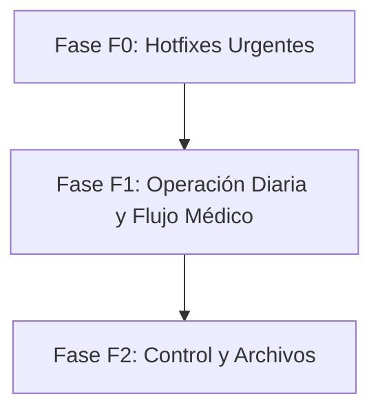

# Feedback Veterinario y Backlog de Mejoras (F0/F1)

Este documento resume el análisis del feedback recibido por parte del personal veterinario (audios, capturas y transcripciones en `Fallos/`) y establece la hoja de ruta priorizada (F0/F1) para las próximas iteraciones del sistema VetERP.

---

## 📋 Resumen del Feedback Analizado

El análisis del audio y capturas de la carpeta local `Fallos/` revela los siguientes puntos clave de fricción y necesidades de los médicos veterinarios y el personal de recepción:

1. **Catálogo & Ajustes**: 
   - *Problema*: Al editar un producto o servicio del catálogo (`Editar Ítem`), los campos de selección de "Categoría" y "Proveedor" mostraban el identificador interno UUID del registro en lugar del nombre legible, y se desalineaban/traslapaban en la interfaz. *(F0 - Resuelto)*.

2. **Agenda & Programación**:
   - *Problema*: Faltan notas de cita al editar o programar citas generales y servicios de grooming (ej. advertencias de comportamiento como "desea que no le toquen la oreja", "cuidado con otitis", etc.).
   - *Problema*: Buscar responsables en un menú desplegable estático se volverá inmanejable con cientos de registros. Se requiere un buscador por nombre de persona, DNI, paciente o código.

3. **Hospitalización**:
   - *Problema*: Falta poder ver la ficha de tratamiento directamente desde la hospitalización para visualizar y registrar los fármacos/tratamientos aplicados, con estados ("en tratamiento", "tratamiento terminado") legibles para otros médicos.

4. **Inventario & Productos**:
   - *Problema*: En la ficha del producto hace falta un campo explícito para la fecha de vencimiento.

5. **Pacientes & Historias Clínicas**:
   - *Problema*: Falta la capacidad de adjuntar archivos/exámenes en la ficha del paciente.
   - *Problema*: La edición de historias clínicas pasadas debe controlarse rigurosamente bajo previa autorización de administrador para evitar alteraciones malintencionadas.

---

## 🚀 Backlog Priorizado (F0 / F1 / F2)

Siguiendo las restricciones de impacto controlado y priorización ágil, se agrupan los desarrollos en las siguientes fases:

### 🔴 Fase F0: Hotfixes & Estabilización (Completado)
*Foco: Corregir errores visuales críticos y bloqueos de usabilidad en formularios existentes.*

| ID | Componente | Descripción | Estado | Prioridad |
|---|---|---|---|---|
| **F0-01** | `Ajustes / Catálogo` | **UUID en categoría/proveedor al Editar Ítem:** Reemplazar el renderizado de UUIDs en dropdowns por sus respectivos nombres legibles (`nombre`) y corregir el ancho con `w-full` para evitar desalineamiento visual. | **✅ Corregido** | Alta |
| **F0-02** | `Repositorio` | **Exclusión de feedback local:** Añadir de forma preventiva la carpeta `Fallos/` y `fallos/` al `.gitignore` para no subir archivos de audio ni capturas pesadas al control de versiones. | **✅ Corregido** | Alta |

---

### 🟡 Fase F1: Operación Diaria y Flujo Clínico (Siguiente Bloque)
*Foco: Mejorar sustancialmente la interacción en la recepción, agenda general y seguimiento de pacientes hospitalizados.*

#### 1. Búsqueda y Notas en Agenda
- **Objetivo**: Evitar selectores interminables y proveer contexto crítico al personal médico/grooming.
- **Detalle Técnico**:
  - Implementar un buscador asíncrono (input con debouncing) en la creación/edición de citas que filtre responsables por **Nombre**, **DNI**, **Nombre del paciente** o **Código**.
  - Agregar un campo de texto multilínea `notas_cita` en la tabla `citas` para guardar especificaciones clínicas o de manejo (ej. *"Cuidado con otitis, no tocar oreja izquierda"*).
- **Tablas afectadas**: `citas` (adición de campo/columna `notas_cita` o `indicaciones` si no existe).

#### 2. Ficha de Fármacos y Tratamiento en Hospitalización
- **Objetivo**: Permitir a los veterinarios ver y cambiar las medicinas aplicadas a un paciente hospitalizado.
- **Detalle Técnico**:
  - Diseñar una sub-pantalla o modal `Ficha de Tratamiento` dentro del módulo de hospitalizaciones.
  - Registrar fármacos, dosis, frecuencia y estado del tratamiento (Activo / Terminado) para que sea transparente entre turnos de médicos.
- **Tablas afectadas**: `hospitalizaciones` (relación 1:N con una nueva tabla `hospitalizacion_tratamientos` o similar).

#### 3. Fecha de Vencimiento en Productos
- **Objetivo**: Controlar el vencimiento de insumos críticos en almacén.
- **Detalle Técnico**:
  - Aunque existe en movimientos (`fecha_vencimiento`), se requiere que la entidad `productos` o su relación con lotes refleje la fecha de caducidad directamente en la visualización rápida de la tabla de inventario.
- **Tablas afectadas**: `items_catalogo` o `lotes` (lectura/escritura).

---

### 🔵 Fase F2: Control Administrativo y Archivos (Mediano Plazo)
*Foco: Robustez legal de la historia clínica y digitalización de exámenes.*

#### 1. Edición Controlada de Historia Clínica
- **Objetivo**: Evitar que cualquier usuario modifique consultas pasadas sin control.
- **Detalle Técnico**:
  - Bloquear la edición directa de registros clínicos antiguos.
  - Implementar un flujo de desbloqueo: un médico solicita editar, y un administrador (rol `admin` / `owner`) debe ingresar sus credenciales o autorizar el cambio mediante una clave / pin temporal.
- **Tablas afectadas**: `historias_clinicas`, `auditoria_ediciones`.

#### 2. Adjuntos en Pacientes
- **Objetivo**: Almacenar recetas externas, análisis de laboratorio y placas de rayos X en la nube.
- **Detalle Técnico**:
  - Habilitar una pestaña "Archivos" en el perfil del paciente.
  - Conectar con Supabase Storage (bucket `pacientes_adjuntos`) con políticas RLS correctas.
- **Tablas afectadas**: Nueva tabla `paciente_adjuntos` para almacenar metadatos de los archivos (nombre, url, tamaño, fecha).

---

## ⚠️ Restricciones del Proyecto & Salvaguardas

Para garantizar estabilidad absoluta de VetERP en producción:
- **Cero cambios destructivos en DB**: Las modificaciones de base de datos para la Fase F1/F2 deben coordinarse mediante archivos de migración estructurados en la carpeta `supabase/migrations/` cuando se apruebe la fase. **No se han ejecutado comandos SQL ni creado migraciones en esta fase de análisis.**
- **Módulos intocables**: Las áreas de **Caja**, **Inventario Físico (Stock)** y **Facturación** se mantienen estrictamente sin alteraciones y solo se acceden en modo lectura.
- **Cambios mínimos garantizados**: El fix aplicado a la Fase F0 conserva la semántica original del código y reutiliza los estilos existentes para asegurar compatibilidad absoluta en el build de producción.
